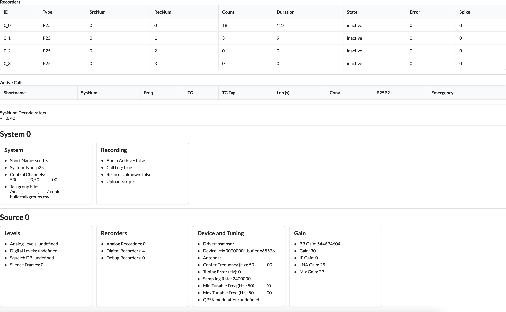

# trunk-recorder-status-server
Lets you monitor the status of recordings
## Install
1) Make sure you have `node` and `npm` installed.
2) clone the repository
3) `cd trunk-recorder-status-server`
4) `npm install`

## Trunk-Recorder config
You need to add `statusServer` to your `config.json` file.
```json
{
  "ver": 2,
    "sources": [{
    }],
    "systems": [{
    }],
    "broadcastifyCallsServer": "abc123",
    ...
    "statusServer": "ws://{ip-address}:3010/server"
}
```
`ws://` indicates a websocket. You will need to replace ip-address of your status-server. It could be `localhost` or the IP address of the machine.

## Running
To run the webserver, change into the directory and run the node app.
```
node index.js
```

### Running in background
To run in the background, use `tmux`
```
tmux

cd {trunk-recorder directory}
node index.js

# control+b 
# d #this disconnect tmux and puts you back into you session
```
To get back into that tmux session run `tmux list-sessions` to get a list of your sessions. Then you can run `tmux attach-session {session number}` to get back into your session.
<br><br>

# Using
To use the webui, go to `http://{ip-address}:3010`.
<br><br>

